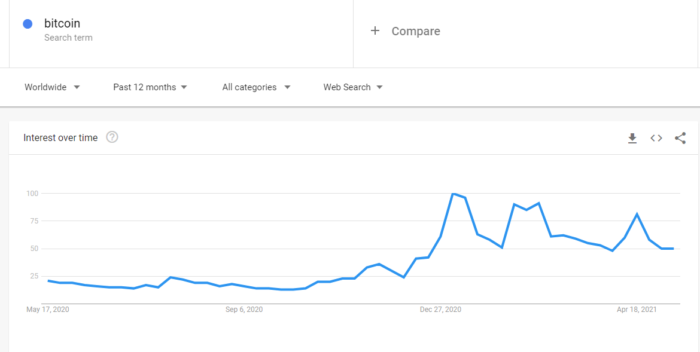
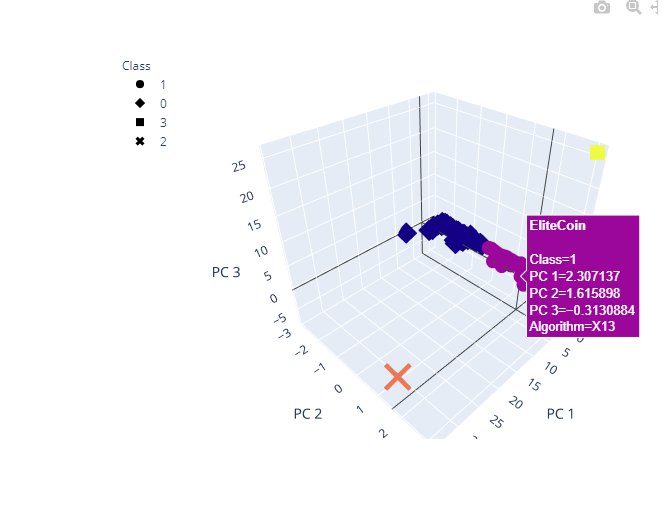

# _Tales From The Crypt-o-currencies_ || Cryptocurrencies Analysis

## Overview of Analysis
Client is looking to pitch a new investment opportunity to an accounting firm, specifically, in cryptocurrencies. 

Since, inception in 2008, Bitcoin, has provided every bit the intrigue as it has an alternative to _traditional_ forms of currency and exchange. Bitcoin can be used to exchange for like or other currencies, services, and products. Bitcoin is derived from [blockchain technology]( https://www.simplilearn.com/tutorials/blockchain-tutorial/blockchain-technology#:~:text=Blockchain%20technology%20is%20a%20structure,'), essentially,  “living” in a decentralized environment , or unregulated space, and despite this remains ever popular. 

In fact, according to statistics pulled from Google Trends, the term “Bitcoin”, has seen an uptick in searches since December 2020 in the United States. 

 
 <b><i>Bitcoin Search (US, Google Trends)</b></i> 
 

 
 

 <b><i>Bitcoin Search (Worldwide, Google Trends)</b></i> 
 

 
 

However, with its increasingly growing popularity, Bitcoin,  and the like, such as Dogecoin [(pronounced dowzh-koyn)](https://www.google.com/search?q=dogecoin+pronunciation&rlz=1C1CHBF_enUS932US932&ei=LlicYO3yPJut5NoPmIiukA4&oq=dogecoin+pro&gs_lcp=Cgdnd3Mtd2l6EAEYAjIFCAAQkQIyCggAELEDEIMBEAoyAggAMgIIADICCAAyDQgAELEDEIMBEMkDEAoyAggAMgIIADIKCAAQsQMQgwEQCjICCAA6BwgAEEcQsAM6BwgAELADEEM6CggAELEDEIMBEEM6CAgAELEDEIMBOgQIABBDOgsIABCxAxCDARDJA1DuNViZRGCzVmgBcAJ4AIABW4gBiwOSAQE1mAEAoAEBqgEHZ3dzLXdpesgBCsABAQ&sclient=gws-wiz), in the [news]( https://www.cnbc.com/2021/05/12/dogecoin-price-surge-elon-musk-slim-jim.html), recently, the market has become quite saturated with cryptocurrencies.  Additionally, posing a barrier of entry for new investors, as cryptocurrencies have become either too expensive and/or unattainable. 

To unearth trends, and cryptocurrencies to ultimately back(invest), this analysis looks at a complex collection of cryptocurrency data to which would later be fitted for an unsupervised machine learning model. 

_Learn more about Bitcoin, [here!]( https://www.coinbase.com/learn/crypto-basics/what-is-bitcoin?utm_source=google_search_nb&utm_medium=cpc&utm_campaign=2043624384&utm_content=113244326632&utm_term=bitcoin%20explained&utm_creative=478113585348&cb_device=c&cb_placement=&cb_country=us&cb_city=open&cb_language=en_us&gclid=CjwKCAjw-e2EBhAhEiwAJI5jg9seV2nJxw5vsH9fACgX7wkyuuIRx2CABXyjE72D3Wq0O3W5xM3K2hoC2tIQAvD_BwE)_
#

## Resources 

* Data Source(s): [crypto_data.csv](https://github.com/SoWhitIs/cryptocurrencies/blob/b775a4b9094e7cdd885de0448482c5ced574bef1/data/crypto_data.csv),   [CryptoCompare](https://minapi.cryptocompare.com/data/all/coinlist)
* Software/Tool(s): Python | Python Libraries: Scikit-learn: StandardScaler, MinMaxScaler, PCA, KMeans Plotly, Holoviews: hvPlot, Pandas| VS Code 1.54.3 | Jupyter Notebook | Jupyter Notebook**  
 *  Data Access: Workaround, [Project Jupyter: jupyter nbviewer](https://nbviewer.jupyter.org/), a Jupyter Notebook renderer **
     *    Data may not display properly on GitHub, please use provided workaround

#
## Results  _& Process_: Snapshot 
Because there were no known outputs for this analysis, it was decided an unsupervised machine learning model would be the best approach.

**Part 1:  Data “Clean-Up”**

Data required preprocessing to be fitted for the machine learning model, including checking for, and removing rows (and columns) with null values. 
Dataset was filtered into various DataFrames. 

Variables were created from the dataset using get_dummies() function, then standardized with  the Scikit-learn’s StandardScaler. 

**Part 2: Principal Component Analysis**

To expedite the algorithm, given the large set of variables, a principal component analysis or PCA was applied. 

Essentially, this application reduced the number of dimensions transforming the larger dataset to a smaller, manageable (seeming less complex) one without lost of information from the main or original data. 

Lastly, a DataFrame consisting of three principal components was created. 

**Part 3: Clustering**

Furthermore, a K-Means clustering algorithm, was used to group cryptocurrencies with a complementing DataFrame. 

To determine the amount of clusters or _”K”_ needed for the K-means algorithm, the use of Elbow Curve method was employed with results from previous Principal Compnent Analysis or PCA. 

Using the HoloViews-hvplot package, the elbow curve suggested a value of 4 was the best number of clusters to input into our K-Means model. 

 <b><i>Elbow Curve to Determine K-Means (Worldwide)</b></i> 
 

 
 

As with steps prior, a new DataFrame consisting of findings from the PCA, cryptocurrencies names and pertinent information was constructed. This newly constructed DataFrame became the basis for data visualization. 

**Part 4: Visualizing Results**

Lastly, all available tradable cryptocurrencies were scaled(MinMaxScaler), housed in a DataFrame, then illustrated (visualized) through both a 3D scatter plot and scatter plot, to which hovering on the data points would reveal the names and information of respective, cryptocurrencies, in separate classes. 

 <b><i>3D Scatter Plot with PCA and Clusters (Worldwide)</b></i> 
 

 
 

 <b><i>Scatter Plot</b></i> 
 

 
 

A table of tradable crypotcurrencies was, too, [generated](images/tradable_crypto_table.png). 

**What did the (unsupervied machine learning) model "unearth"?**

The analysis revealed there are 532 tradable cryptocurrencies. 

---

#### Author 

_Whitney D. Gardner_

